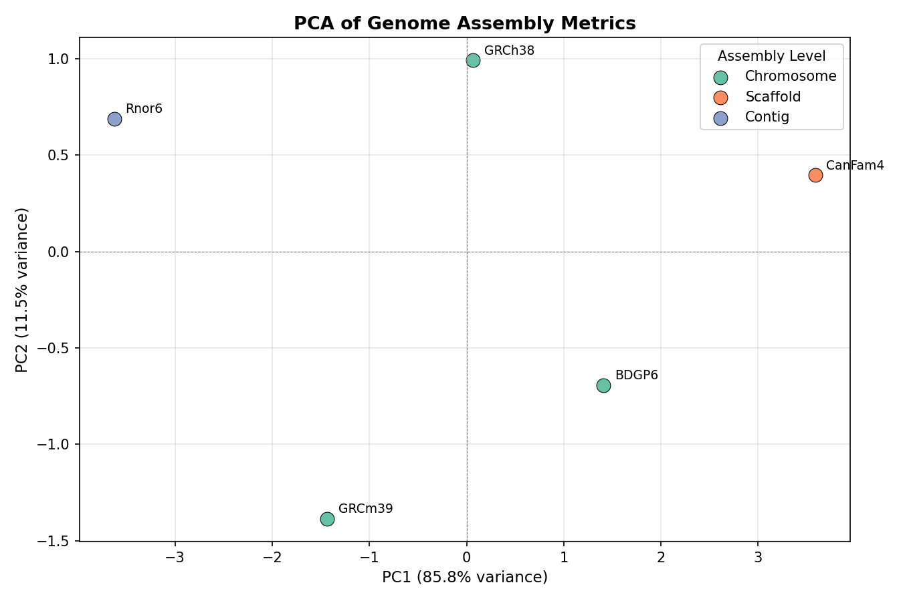
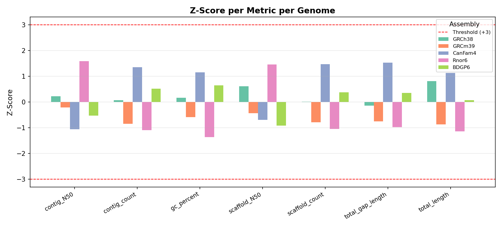
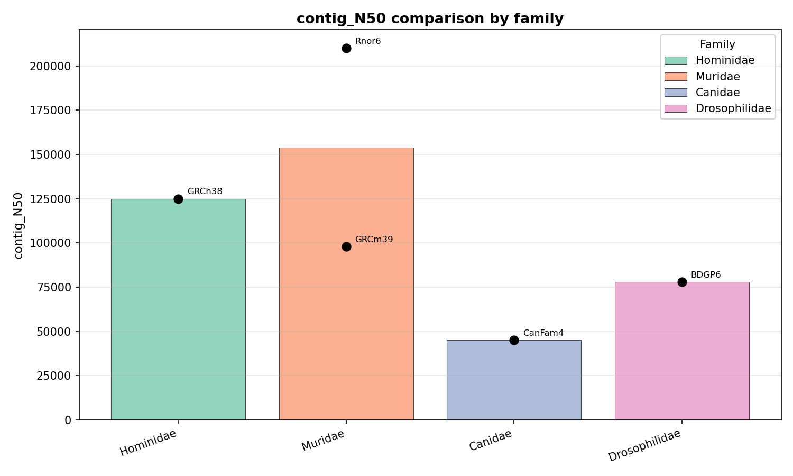

# Genome Metrics Analysis

A modular Python toolkit for analysing genome assembly metrics,
built as a proof-of-work for the GSoC 2026 project:
**"Annotation Metrics Reporting & Analysis Modules"** at EMBL-EBI / Ensembl.

---

## Overview

Genome annotation metrics in the Ensembl system are stored in a key-value
format (`assembly_metrics` table). This toolkit transforms that data into
structured, analysable format and provides modules for:

- Per-genome metrics reporting with percentile ranks
- PCA-based comparative analysis across genomes
- Outlier detection using configurable z-score thresholds
- Taxonomy-based grouping and comparison

---

## Project Structure
```
genome-metrics-analysis/
├── data/
│   ├── raw.csv                  # Key-value format metrics (mirrors assembly_metrics table)
│   ├── assembly_info.csv        # Assembly metadata (mirrors assembly table)
│   └── outputs/                 # Generated plots
├── src/
│   ├── db/
│   │   └── load_data.py         # Loads, pivots and merges data
│   ├── analysis/
│   │   ├── pca.py               # PCA analysis and visualization
│   │   ├── outlier_detection.py # Z-score based outlier detection
│   │   └── comparison.py        # Taxonomy-based comparison
│   └── services/
│       └── report_service.py    # Per-genome metrics report
├── tests/                       # Unit tests
├── cli.py                       # Command line interface
└── config.yaml                  # Configurable parameters
```

---

## Data Model

The sample data mirrors the real Ensembl MySQL schema:

**`assembly_metrics` table (key-value format):**
```
assembly_id | metrics_name  | metrics_value
1           | contig_N50    | 125000
1           | total_length  | 2800000000
```

**`assembly` table:**
```
assembly_id | gca_chain | asm_type | asm_level | lowest_taxon_id | ...
```

The `load_data.py` module pivots key-value metrics into wide format
and merges with assembly metadata — ready for analysis.

---

## Usage

### Generate a per-genome report
```bash
python cli.py report --assembly-id 1
```

### Run PCA analysis
```bash
python cli.py pca
```

### Detect outlier genomes
```bash
python cli.py outliers
```

### Compare metrics across taxonomy groups
```bash
python cli.py compare --rank family --metric contig_N50
```

---

## Configuration

All parameters are controlled via `config.yaml`:
```yaml
data:
  raw_metrics: data/raw.csv
  assembly_info: data/assembly_info.csv

analysis:
  outlier_threshold: 3.0        # Z-score threshold for outlier flagging
  default_taxonomy_rank: species # Options: species, genus, family, order_name
```

---

## Example Outputs

### PCA Plot
Genomes projected onto 2 principal components.
PC1 captures 85.8% of variance, PC2 captures 11.5%.



### Outlier Detection
Z-scores per metric per genome. Red lines mark the threshold.



### Taxonomy Comparison
Metric comparison across taxonomy groups with individual points overlaid.



---

## Installation
```bash
git clone https://github.com/VidhanGupta-01/genome-metrics-analysis.git
cd genome-metrics-analysis
pip install -r requirements.txt
```

---

## Requirements
```
pandas
scikit-learn
matplotlib
pyyaml
```

---

## Notes

- Taxonomy grouping uses `lowest_taxon_id` from the Ensembl schema.
  In production, rank info would be fetched from the NCBI Taxonomy API.
- Outlier thresholds are configurable. Default z > 3.0 is standard
  for large datasets. Lower thresholds (e.g. 1.5) can be used for
  smaller sample sizes.
- All modules are stateless and designed to scale to large genome sets.
```

---

Also create `requirements.txt` at root:
```
pandas
scikit-learn
matplotlib
pyyaml